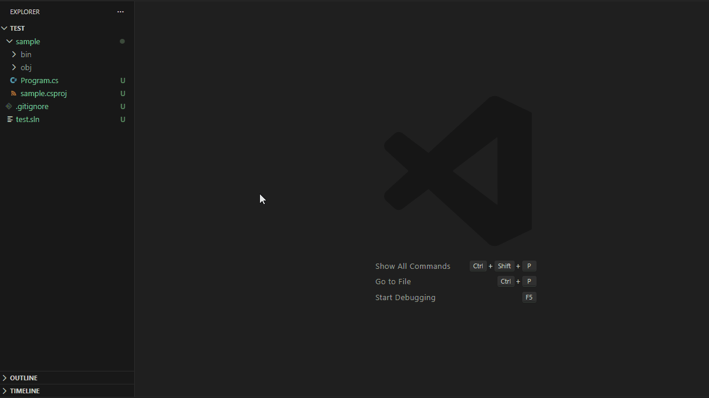
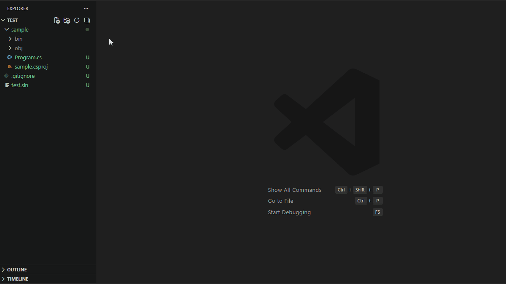
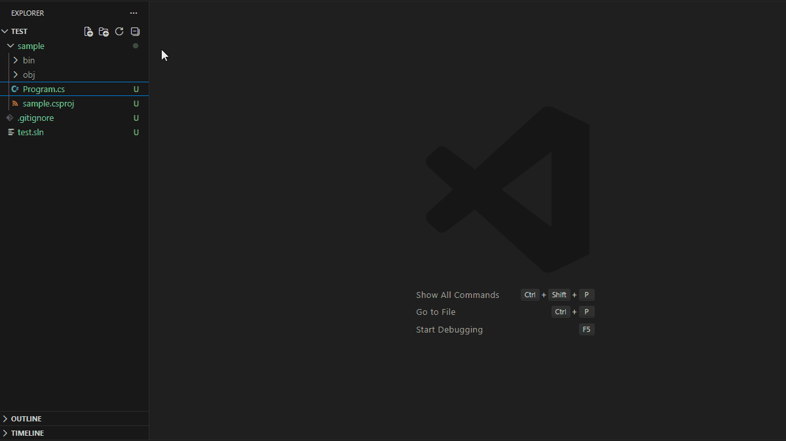
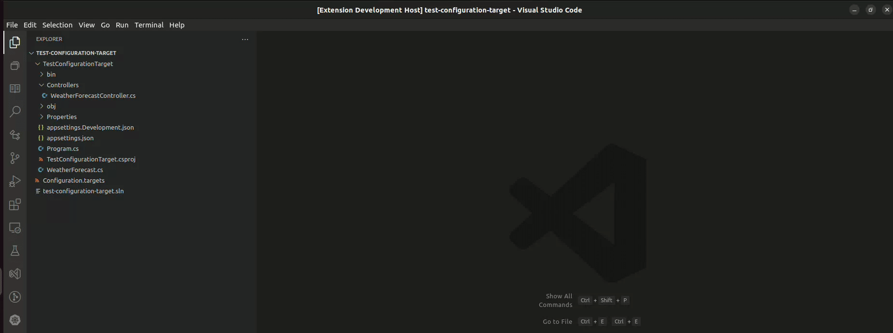

# Customized version of <a href="https://github.com/jchannon/csharpextensions">jchannon/csharpextensions</a> → <a href="https://github.com/KreativJos/csharpextensions">KreativJos/csharpextensions</a>  → <a href="https://github.com/bard83/csharpextensions">bard83/csharpextensions</a>

# C# Extensions

Welcome to C# Extensions. This VSCode extension provides extensions to the IDE that will hopefully speed up your development workflow.
It can currently be found at:

- [VS Code Marketplace](https://marketplace.visualstudio.com/items?itemName=bard83.csharpextension)
- Open VSX (not yet published)

## Features

C# Extensions provides a set of templates to create C# components like classes, interfaces, enums and so on. It also provides some code actions to generate constructors from properties and body expression constructors from properties.

CSharp items can be created from the VSCode command palette (i.e. Class, Interface, Struct and so on.). The extension determinates the destination path based on the current opened file in the editor.
In case no files are currently opened in the editor, it will be shown an input box where the destination path must be typed. The destination path must be valid and within the workspace folder. In case the input path is left empty the final destination path will be the current workspace folder.

This extension traverses up the folder tree to find the project.json or *.csproj and uses that as the parent folder to determine namespaces.


### Default Templates

C# Extensions provides the following templates:

- **Add C# Class**: Creates a new C# class file with the specified name and the current namespace based on the folder structure. The class will be created with a default using section.


- **Add C# Interface**: Creates a new C# interface file with the specified name and the current namespace based on the folder structure.


- **Add C# Struct**: Creates a new C# struct file with the specified name and the current namespace based on the folder structure.



- **Add C# Record**: Creates a new C# record file with the specified name and the current namespace based on the folder structure. This template is available **only for Frameworks that support C# 9.0 or higher**.



- **Add C# Enum**: Creates a new C# enum file with the specified name and the current namespace based on the folder structure.



### Custom Templates

The custom template must be defined in the vscode `settings.json` file. Access to File->Preference->Settings, Explode the Extensions section and select C# Extension then click on `edit in settings.json` .In the new section `csharpextensions.templates` must define the list of `items` which contain the custom templates. An item template is defined like below:

```json
{
    "name": "MyCustomTemplate",
    "visibility": "public",
    "construct": "class",
    "description": "My awesome c# template",
    "header": "using System;\nusing System.Runtime.Serialization;\nusing System.Text.Json;",
    "attributes": [
        "DbContext(typeof(AppDbContext))",
        "Migration(\"${classname}\")"
    ],
    "genericsDefinition": "I,J,K",
    "declaration": "ISerializable, IEquatable",
    "genericsWhereClauses": [
        "where I : class",
        "where J : struct",
        "where K : IMyInterface",
    ],
    "body": "public void MyFancyMethod(string variable)\n{\n    System.Console.WriteLine(\"Hello World\");\n}"
}
```

`visibility` C# component visibility (public, private and etc...);

`construct` actually supported `class`, `interface` and `struct`;

`header` is used to group all the necessary usings module. Each using must be separated by a `;`. The keyword `using` or the new line `\n` can be omitted. "using System;\nusing System.Runtime.Serialization;\nusing System.Text.Json;" and "System;System.Runtime.Serialization;System.Text.Json" produce the same output. Implicit usings rules will be applied.

`genericsDefinition` used to specify the generics for the construct automatically enclosed between `<>`;

`declaration` used to append all the necessary extended or implemented class or interface. The colon before the declaration will be automatically added. It could be used to add also generic clauses.

`attributes` used to specify the attributes for the construct. The attributes must be specified in a list of string. Using the placeholder `${classname}` the construct name will be replaced instead.

`genericsWhereClauses` used to define the generics where clauses inside the custom template.

`body` body of template. It might be whatever C# code. The placeholder `${classname}` gets replaced with the file name if it's defined.

Please note that the code defined inside the custom template should be valid C# code. This extension does not perform any validation on it.

- **Add new custom template**



### Code Actions

To activate the code actions, place the cursor on a class declaration and open the code actions menu (Ctrl + .). You will see the following options:

- **Add constructor from properties**: Generates a constructor with parameters for each property in the class. The constructor will be created with the same visibility as the class.


- **Add body expression constructor from properties**: Generates a constructor with parameters for each property in the class and initializes the properties using an expression body. The constructor will be created with the same visibility as the class.


-----------------------------------------------------------------------------------------------------------

## Licence

MIT

See [LICENSE](./LICENSE.txt)

## Legacy Repositories

- [jchannon/csharpextensions](https://github.com/jchannon/csharpextensions)
- [KreativJos/csharpextensions](https://github.com/KreativJos/csharpextensions)
