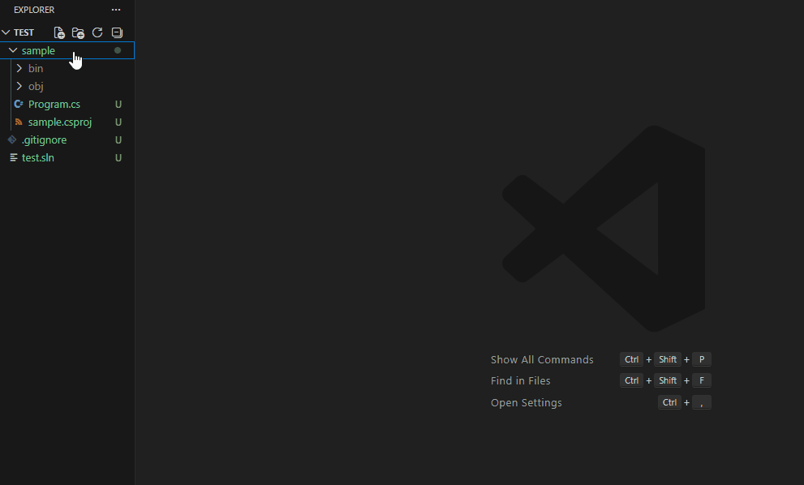
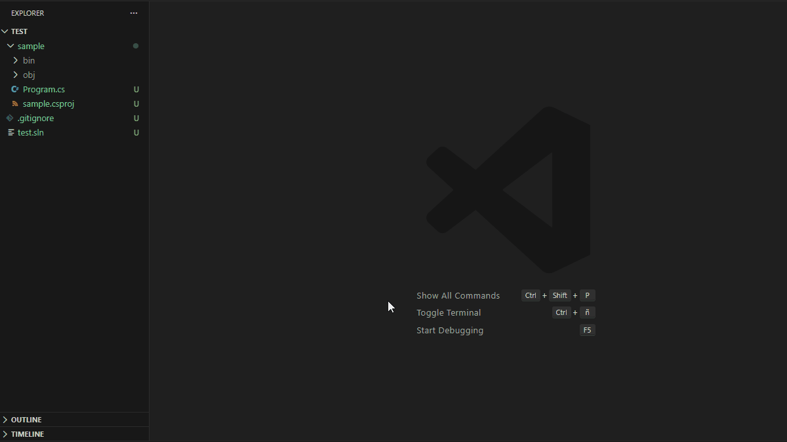
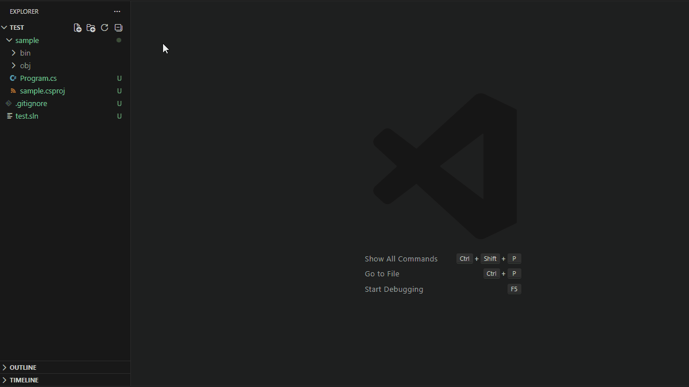
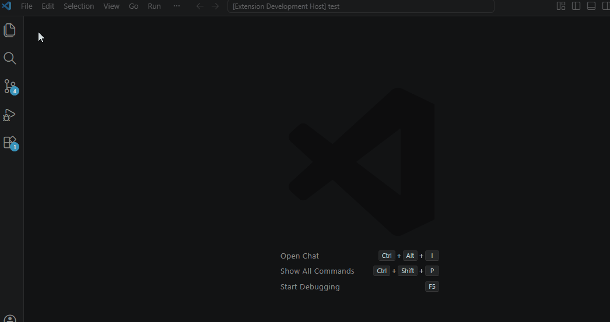
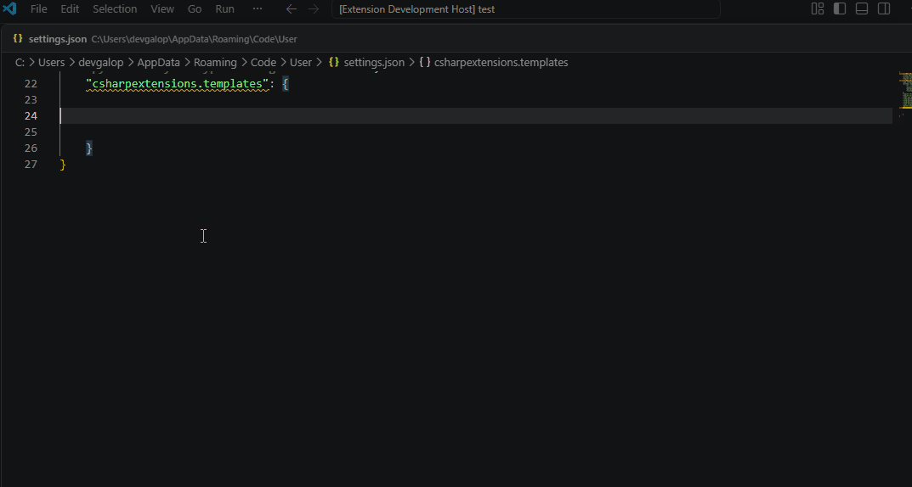
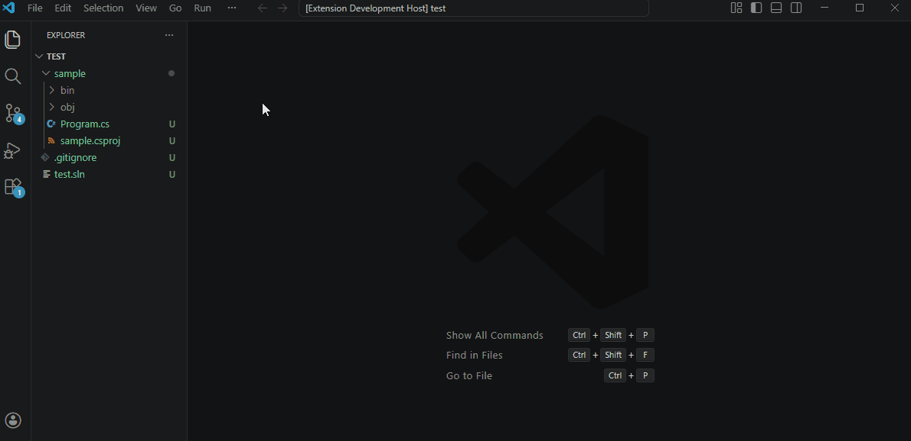
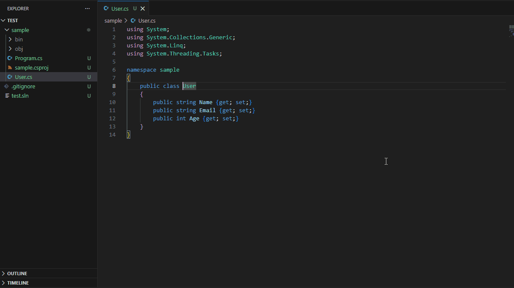
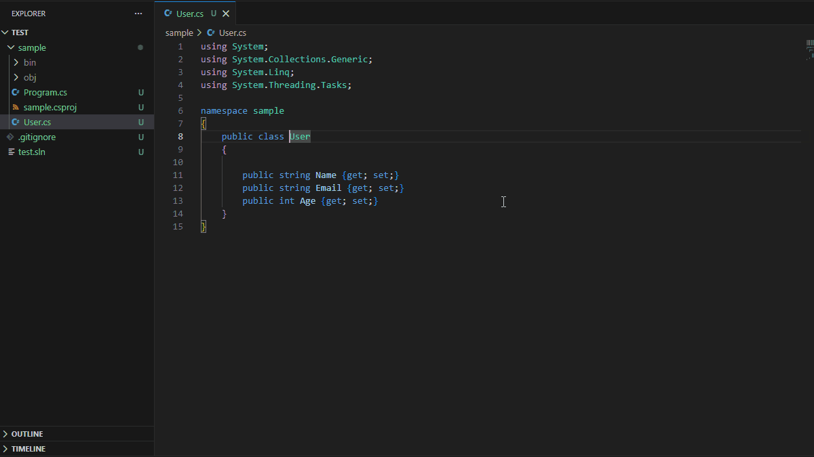

# Customized version of <a href="https://github.com/jchannon/csharpextensions">jchannon/csharpextensions</a> → <a href="https://github.com/KreativJos/csharpextensions">KreativJos/csharpextensions</a>  → <a href="https://github.com/bard83/csharpextensions">bard83/csharpextensions</a>

# C# Extensions

Welcome to C# Extensions. This VSCode extension provides extensions to the IDE that will hopefully speed up your development workflow.
It can currently be found at:

- [VS Code Marketplace](https://marketplace.visualstudio.com/items?itemName=bard83.csharpextension)
- Open VSX (not yet published)

## Table of Contents

- [Features](#features)
- [Default Templates](#default-templates)
- [Custom Templates](#custom-templates)
- [Code Actions](#code-actions)
- [Configuration](#configuration)
- [License](#license)
- [Legacy Repositories](#legacy-repositories)

## Features

C# Extensions provides a set of templates to create C# components like classes, interfaces, enums and so on. It also provides some code actions to generate constructors from properties and body expression constructors from properties.

CSharp items can be created from the VSCode command palette (i.e. Class, Interface, Struct and so on.). The extension determinates the destination path based on the current opened file in the editor.

In case no files are currently opened in the editor, it will be shown an input box where the destination path must be typed. The destination path must be valid and within the workspace folder. In case the input path is left empty the final destination path will be the current workspace folder.

This extension traverses up the folder tree to find the `project.json` or `*.csproj` and uses that as the parent folder to determine namespaces.



### Default Templates

The C# Extensions tool provides multiple default templates for creating C# components, such as classes, interfaces, and enumerations. Some examples of these templates are:

- **Add C# Class**: Creates a new C# class file with the specified name and the current namespace based on the folder structure. The class will be created with a default using section.



- **Add C# Interface**: Creates a new C# interface file with the specified name and the current namespace based on the folder structure.



For more details about the default templates, please refer to the [Templates documentation](./TEMPLATES.md).

### Custom Templates

C# extensions allows users to define custom templates to suit their specific needs. The custom template must be defined in the vscode `settings.json` file. Access to File->Preference->Settings, Explore the Extensions section and select C# Extension, then click on `edit in settings.json`. In the new section `csharpextensions.templates` must define the list of `items` which contain the custom templates. An item template is defined like below:

```json
{
    "name": "MyCustomTemplate",
    "visibility": "public",
    "construct": "class",
    "description": "My awesome c# template",
    "header": "using System;\nusing System.Runtime.Serialization;\nusing System.Text.Json;",
    "attributes": [
        "DbContext(typeof(AppDbContext))",
        "Migration(\"${classname}\")"
    ],
    "genericsDefinition": "I,J,K",
    "declaration": "ISerializable, IEquatable",
    "genericsWhereClauses": [
        "where I : class",
        "where J : struct",
        "where K : IMyInterface",
    ],
    "body": "public void MyFancyMethod(string variable)\n{\n    System.Console.WriteLine(\"Hello World\");\n}"
}
```

Please note that the code defined inside **the custom template should be valid C# code**. This extension does not perform any validation on it.

For more details about the custom templates, please refer to the [Templates documentation](./TEMPLATES.md).

- **Modify settings.json to add new custom template**



- **Add new custom template**



- **Add a file using custom template**



### Code Actions

To activate the code actions, place the cursor on a class declaration and open the code actions menu (Ctrl + .). You will see the following options:

- **Add constructor from properties**: Generates a constructor with parameters for each property in the class. The constructor will be created with the same visibility as the class.



- **Add body expression constructor from properties**: Generates a constructor with parameters for each property in the class and initializes the properties using an expression body. The constructor will be created with the same visibility as the class.



## Configuration

C# Extensions can be configured to customize its behavior and features. The configuration options allow you to enable or disable specific features, set default values, and tailor the extension to your preferences.

To see all the available configuration options, please refer to the [Configuration documentation](./CONFIG.md).

## License

MIT

See [LICENSE](./LICENSE.txt)

## Legacy Repositories

- [jchannon/csharpextensions](https://github.com/jchannon/csharpextensions)
- [KreativJos/csharpextensions](https://github.com/KreativJos/csharpextensions)
